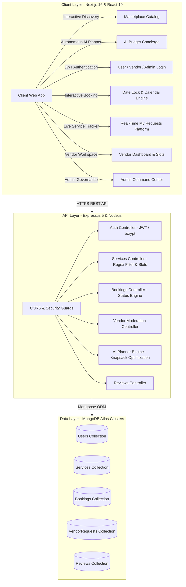

# 🚀 ServEase — Autonomous AI-Driven Event & Service Marketplace Platform

[](https://nextjs.org/)
[](https://react.dev/)
[](https://nodejs.org/)
[](https://expressjs.com/)
[](https://www.mongodb.com/atlas)
[](https://tailwindcss.com/)
[](https://vercel.com/)
[](https://render.com/)

**ServEase** is an end-to-end, production-grade event service marketplace and autonomous AI event planner designed to bridge the gap between verified event service vendors, clients, and platform administrators. Built with a modern micro-client architecture using **Next.js 16 (App Router)**, **React 19**, and an **Express 5 REST API** backed by **MongoDB Atlas**.

---

## 🌐 Live Production Deployments

* 🖥️ **Live Web Application (Vercel):** [https://serv-ease-omega.vercel.app](https://serv-ease-omega.vercel.app)
* 🤖 **AI Event Planner (Vercel):** [https://serv-ease-omega.vercel.app/ai-planner](https://serv-ease-omega.vercel.app/ai-planner)
* 🔌 **Live REST API Server (Render):** [https://servease-backend-2vy8.onrender.com](https://servease-backend-2vy8.onrender.com)
* 📂 **GitHub Repository:** [https://github.com/gdiya2004/ServEase](https://github.com/gdiya2004/ServEase)

---

## 🏗️ System Architecture & Data Flow



---

## ✨ Key Technical Pillars & Standout Features

### 🤖 1. Autonomous AI Event Concierge & Smart Budget Package Planner
* **How it Works:** Customers enter their celebration type (*Wedding, Engagement, Birthday, Gala*), target city, guest count, and total budget (e.g. *₹1,00,000*).
* **Heuristic Optimization Engine (`/api/ai/plan-event`):** Partitions the total budget using industry standard benchmarks:
  $$\text{Catering: 35\%} \quad | \quad \text{Decor: 30\%} \quad | \quad \text{Photography: 20\%} \quad | \quad \text{DJ/Music: 10\%} \quad | \quad \text{Contingency: 5\%}$$
* **Best-Fit Knapsack Search:** Matches verified vendors within category quotas, computes total cost & contingency savings, generates a 5-point event schedule, and enables **1-Click Coordinated Bundled Requests**.

---

### 📅 2. Interactive Live Slot & Date Availability Calendar (Airbnb-Style)
* **Double-Booking Prevention:** Custom `CalendarPicker` component on service pages color-codes dates (**🟢 Available**, **🔴 Booked / Unavailable**, **🟡 Selected**).
* **Automatic Date Locking:** When a vendor clicks `Accept Booking`, the chosen `eventDate` is automatically appended to the service's `bookedDates` list to lock out conflicting clients.
* **Vendor Slot Management:** Vendors can manually block or unblock specific calendar dates from their dashboard.

---

### 📱 3. Real-Time Customer Service Management Platform (`/my-bookings`)
* **Live Background Polling:** Auto-syncs every 12 seconds with a manual `🔄 Refresh Status` control.
* **4-Stage Visual Fulfillment Stepper:**  
  `[1. Requested ✓]  ➔  [2. Under Vendor Review ⏳]  ➔  [3. Decision: Accepted ✅ / Disapproved ❌]  ➔  [4. Service Delivered ⭐]`
* **Context-Aware Action Banners:**
  * **Accepted:** Shows glowing emerald badge + direct **`📞 Call Vendor`** and **`💬 WhatsApp`** shortcuts with pre-filled event inquiry text.
  * **Disapproved:** Shows rose warning banner + 1-click **`🔍 Find Alternative Services`** link.

---

### 🧑‍💼 4. Vendor Workspace & Interactive Fulfillment Pipeline (`/dashboard`)
* **Listing Management:** Create and delete event listings, track total portfolio valuation, and manage slot calendars.
* **Interactive Booking Pipeline:** Filter bookings by `All`, `Pending`, `Confirmed`, and `Completed`.
* **1-Click Actions:** Real-time state transitions: **`✓ Accept Booking`**, **`✕ Decline`**, and **`✓ Mark as Completed`**.

---

### 🛡️ 5. Admin Governance & Command Center (`/admin`)
* **Pending Vendor Applications:** Inspect applicant credentials, portfolio images, and business details with 1-click **Approve** and **Reject** controls.
* **Approved Vendors Directory:** Dedicated audit table showing verified vendor accounts, contact numbers, locations, and active status.
* **Customer Bookings Feed:** Centralized audit log of all customer reservations across every vendor on the platform.

---

## 🛠️ Technology Stack

| Layer | Technology | Purpose |
| :--- | :--- | :--- |
| **Frontend Framework** | Next.js 16.2.4 (App Router) | High-performance React framework with hybrid SSR / Client components |
| **UI Library** | React 19.2.4 | Modern reactive component architecture & hooks |
| **Styling** | Tailwind CSS v4 | Curated HSL color palettes, luxury glassmorphism, and responsive layouts |
| **Backend Runtime** | Node.js (v22.x / v24.x) | Asynchronous non-blocking JavaScript server environment |
| **API Framework** | Express.js 5.x | Scalable REST API with custom CORS and path routing |
| **Database** | MongoDB Atlas | Cloud NoSQL document database with Mongoose ODM |
| **Authentication** | JWT (JSON Web Tokens) & bcryptjs | Stateless token authorization with salted cryptographic hashing |
| **Hosting & CI/CD** | Vercel & Render | Continuous deployment pipelines for frontend and backend |

---

## 📂 Repository Structure

```
ServEase/
├── evervice-frontend/             # Next.js Frontend Application
│   ├── src/
│   │   └── app/
│   │       ├── admin/             # Admin command center & vendor directory
│   │       ├── ai-planner/        # AI Event Concierge & Smart Budget Package Planner
│   │       ├── components/        # Reusable UI components (Navbar, CalendarPicker)
│   │       ├── dashboard/         # Vendor workspace, slot calendar & booking pipeline
│   │       ├── login/             # User & Vendor authentication
│   │       ├── my-bookings/       # Real-time customer service management platform
│   │       ├── services/[id]/     # Dynamic service details & live calendar booking
│   │       ├── signup/            # Account registration
│   │       ├── vendor-request/    # Vendor application form
│   │       └── page.tsx           # Main marketplace discovery page
│   ├── package.json
│   └── tsconfig.json
│
├── evervide-backend/              # Express.js REST API Server
│   ├── middleware/
│   │   └── auth.js                # JWT verification & role authorization guards
│   ├── models/
│   │   ├── Booking.js             # Booking schema with eventDate and status enums
│   │   ├── Review.js              # Service reviews schema
│   │   ├── Service.js             # Marketplace service schema with bookedDates array
│   │   ├── User.js                # User & role schema (user, vendor, admin)
│   │   └── VendorRequest.js       # Vendor application submission schema
│   ├── routes/
│   │   ├── aiRoutes.js            # Heuristic AI Event Concierge & Budget Planner
│   │   ├── authRoutes.js          # Signup, login & profile sync endpoints
│   │   ├── bookingRoutes.js       # Status updates, date locking & user/vendor queries
│   │   ├── reviewRoutes.js        # Review CRUD operations
│   │   ├── serviceRoutes.js       # Filtered search & calendar slot availability
│   │   └── vendorRoutes.js        # Approved directory & application review
│   ├── seedAllDatabases.js        # Universal MongoDB Atlas multi-target seeder
│   ├── package.json
│   └── server.js                  # Express 5 application entrypoint
│
├── .gitignore                     # Security exclusions (.env, node_modules, build artifacts)
└── README.md                      # Project documentation
```

---

## 📡 REST API Reference

### 🤖 AI Event Concierge (`/api/ai`)
* `POST /api/ai/plan-event` — Generates an optimized multi-vendor package, budget breakdown, savings estimate, and timeline schedule based on event type, location, guest count, and budget.

### 🎪 Services & Calendar Slots (`/api/services`)
* `GET /api/services` — Query services with optional query filters (`location`, `category`, `minPrice`, `maxPrice`)
* `GET /api/services/:id` — Fetch service details
* `GET /api/services/:id/availability` — Retrieve booked and blocked calendar dates
* `POST /api/services/:id/availability` — Vendor toggle to block or unblock specific calendar dates
* `GET /api/services/vendor/:id` — Fetch all listings owned by a specific vendor
* `POST /api/services/add` — Create a new service listing *(Vendor Guarded)*
* `DELETE /api/services/:id` — Remove an existing service listing *(Vendor Guarded)*

### 📅 Bookings & Status Machine (`/api/bookings`)
* `POST /api/bookings/add` — Submit a service booking inquiry with preferred `eventDate`
* `PATCH /api/bookings/:id/status` — Update booking status (`pending`, `confirmed`, `rejected`, `completed`) and automatically locks/unlocks calendar dates
* `GET /api/bookings/user/:id` — Retrieve booking history and live status for a customer
* `GET /api/bookings/vendor/:id` — Retrieve bookings received by a vendor
* `GET /api/bookings/all` — Retrieve all platform bookings *(Admin Guarded)*

### 🧑‍💼 Vendor Operations & Moderation (`/api/vendor`)
* `POST /api/vendor/request` — Submit vendor partnership application
* `GET /api/vendor/requests` — Retrieve pending applications *(Admin Guarded)*
* `GET /api/vendor/approved` — Retrieve verified approved vendors directory *(Admin Guarded)*
* `POST /api/vendor/approve` — Approve application and promote user to `vendor` *(Admin Guarded)*
* `POST /api/vendor/reject` — Reject application *(Admin Guarded)*

### 🔐 Authentication (`/api/auth`)
* `POST /api/auth/signup` — Register new user account
* `POST /api/auth/login` — Authenticate and receive JWT token
* `GET /api/auth/user/:id` — Fetch user role and profile state

---

## 💻 Local Development Setup

### 1. Prerequisites
* Node.js v20+ installed
* MongoDB Atlas cluster or local MongoDB instance
* Git

### 2. Clone Repository
```bash
git clone https://github.com/gdiya2004/ServEase.git
cd ServEase
```

### 3. Backend Setup
```bash
cd evervide-backend
npm install

# Create .env file
echo "PORT=5000" >> .env
echo "MONGO_URI=mongodb+srv://<username>:<password>@<cluster>.mongodb.net/test?retryWrites=true&w=majority" >> .env
echo "JWT_SECRET=your_secret_jwt_key_2026" >> .env

# Seed 27+ realistic services & approved vendor requests
node seedAllDatabases.js

# Start backend server
node server.js
```

### 4. Frontend Setup
```bash
cd ../evervice-frontend
npm install

# Create .env.local file
echo "NEXT_PUBLIC_API_URL=http://localhost:5000" >> .env.local

# Start frontend dev server
npm run dev
```

Open **[http://localhost:3000](http://localhost:3000)** in your browser.

---

## 🔒 Security Implementations

* **Password Protection:** Cryptographic hashing using `bcryptjs` with salt rounds.
* **Token Authorization:** Stateless JWT tokens containing signed user ID and role payload.
* **CORS & Preflight Handling:** Configured Express 5 preflight handlers allowing safe API consumption.
* **Role Verification Middleware:** Route-level interceptors enforcing admin and vendor permission boundaries.

---

## 👩‍💻 Author

**Diya Gupta**  
* GitHub: [@gdiya2004](https://github.com/gdiya2004)  
* Email: [192004gupta@gmail.com](mailto:192004gupta@gmail.com)
