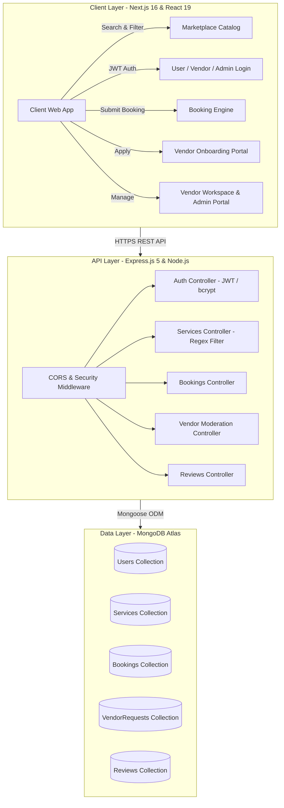

# 🚀 ServEase — On-Demand Services & Event Marketplace

[](https://nextjs.org/)
[](https://react.dev/)
[](https://nodejs.org/)
[](https://expressjs.com/)
[](https://www.mongodb.com/atlas)
[](https://tailwindcss.com/)
[](https://vercel.com/)
[](https://render.com/)

**ServEase** is an end-to-end, production-grade service and event marketplace platform designed to bridge the gap between event service vendors, clients, and platform administrators. Built with a modern micro-client architecture using **Next.js 16 (App Router)** and an **Express 5 REST API** backed by **MongoDB Atlas**.

---

## 🌐 Live Production Links

* 🖥️ **Live Web Application (Vercel):** [https://serv-ease-omega.vercel.app](https://serv-ease-omega.vercel.app)
* 🔌 **Live REST API Server (Render):** [https://servease-backend-2vy8.onrender.com](https://servease-backend-2vy8.onrender.com)
* 📂 **GitHub Repository:** [https://github.com/gdiya2004/ServEase](https://github.com/gdiya2004/ServEase)

---

## 🏗️ System Architecture & Data Flow



---

## ✨ Key Features & Role-Based Access Control (RBAC)

### 👤 1. Customer / Client Experience
* **Dynamic Search & Filtering:** Case-insensitive regex search querying by Location, Category (Wedding, Decor, Catering, Photography, etc.), Minimum Price, and Maximum Price.
* **Service Detail Pages:** Dynamic image rendering, full descriptions, location tags, and transparent pricing breakdowns.
* **Instant Booking System:** Book services directly with customized requirements and direct vendor communication details.
* **Feedback & Reviews:** Read testimonials and submit verified reviews for completed services.

### 🧑‍💼 2. Vendor Workspace
* **Self-Serve Onboarding:** Submit vendor profile with business description, contact information, and portfolio uploads.
* **Workspace Dashboard:** Real-time metrics tracking active listings, client inquiries, and total valuation.
* **Service Catalog Management:** Create new service listings with rich metadata or delete obsolete ones.
* **Booking Pipeline:** Access real-time incoming booking inquiries with full customer contact notes.

### 🛡️ 3. Admin Moderation Portal
* **Application Review Queue:** Inspect applicant credentials, portfolio submissions, and contact details.
* **1-Click Approvals:** Automated status updates that immediately grant `vendor` role permissions.
* **Platform-Wide Bookings Feed:** Centralized audit log of all bookings across every vendor on the platform.

---

## 🛠️ Technology Stack

| Domain | Technology | Purpose |
| :--- | :--- | :--- |
| **Frontend Framework** | Next.js 16.2.4 (App Router) | High-performance React framework with server/client components |
| **UI Library** | React 19.2.4 | Dynamic reactive component architecture |
| **Styling** | Tailwind CSS v4 | Responsive, mobile-first design tokens and glassmorphism UI |
| **Backend Runtime** | Node.js (v22.x / v24.x) | Asynchronous non-blocking runtime environment |
| **API Framework** | Express.js 5.x | Scalable REST API with custom routing and middleware |
| **Database** | MongoDB Atlas | Cloud NoSQL document database with Mongoose ODM |
| **Authentication** | JWT (JSON Web Tokens) & bcryptjs | Stateless token-based auth with salted password hashing |
| **Hosting** | Vercel (Frontend) & Render (Backend) | Auto-deploying CI/CD cloud infrastructure |

---

## 📂 Repository Structure

```
ServEase/
├── evervice-frontend/             # Next.js Frontend Application
│   ├── src/
│   │   └── app/
│   │       ├── admin/             # Admin moderation portal
│   │       ├── components/        # Reusable UI components (Navbar, FilterBar, ServiceCard)
│   │       ├── dashboard/         # Vendor workspace & listing creation (/create)
│   │       ├── login/             # User & Vendor authentication
│   │       ├── services/[id]/     # Dynamic service details & booking modal
│   │       ├── signup/            # Account registration
│   │       ├── vendor-request/    # Vendor application form
│   │       └── page.tsx           # Main marketplace discovery page
│   ├── package.json
│   └── tsconfig.json
│
├── evervide-backend/              # Express.js REST API Server
│   ├── middleware/
│   │   └── auth.js                # JWT verification & role authorization guards
│   ├── models/
│   │   ├── Booking.js             # Booking schema with ref relations
│   │   ├── Review.js              # Service reviews schema
│   │   ├── Service.js             # Marketplace service schema
│   │   ├── User.js                # User & role schema (user, vendor, admin)
│   │   └── VendorRequest.js       # Vendor application submission schema
│   ├── routes/
│   │   ├── authRoutes.js          # Signup, login & profile sync endpoints
│   │   ├── bookingRoutes.js       # Booking operations & admin retrieval
│   │   ├── reviewRoutes.js        # Review CRUD operations
│   │   ├── serviceRoutes.js       # Filtered search & service management
│   │   └── vendorRoutes.js        # Application submission, approval & rejection
│   ├── import_local_data.js       # Database seeder utility
│   ├── make_admin.js              # Admin initialization script
│   ├── package.json
│   └── server.js                  # Express application entrypoint
│
├── .gitignore                     # Security exclusions (.env, node_modules, build artifacts)
└── README.md                      # Project documentation
```

---

## 📡 REST API Reference

### 🔐 Authentication (`/api/auth`)
* `POST /api/auth/signup` — Register new user account
* `POST /api/auth/login` — Authenticate and receive JWT token
* `GET /api/auth/user/:id` — Fetch user role and profile state

### 🎪 Services (`/api/services`)
* `GET /api/services` — Query services with optional query filters (`location`, `category`, `minPrice`, `maxPrice`)
* `GET /api/services/:id` — Fetch details of a specific service
* `GET /api/services/vendor/:id` — Fetch all services created by a specific vendor
* `POST /api/services/add` — Create a new service listing *(Vendor)*
* `DELETE /api/services/:id` — Remove an existing service listing *(Vendor)*

### 📅 Bookings (`/api/bookings`)
* `POST /api/bookings/add` — Submit a service booking inquiry
* `GET /api/bookings/vendor/:id` — Retrieve bookings received by a vendor
* `GET /api/bookings/all` — Retrieve all platform bookings *(Admin Guarded)*

### 🧑‍💼 Vendor Operations (`/api/vendor`)
* `POST /api/vendor/request` — Submit vendor partnership application
* `GET /api/vendor/requests` — Retrieve pending applications *(Admin Guarded)*
* `POST /api/vendor/approve` — Approve application and upgrade user role *(Admin Guarded)*
* `POST /api/vendor/reject` — Reject application *(Admin Guarded)*

### ⭐ Reviews (`/api/reviews`)
* `POST /api/reviews/add` — Post a service review
* `GET /api/reviews/:serviceId` — Get all reviews for a service

---

## 💻 Local Development Setup

### 1. Prerequisites
* Node.js v20+ installed
* MongoDB instance (local or MongoDB Atlas connection string)
* Git

### 2. Clone Repository
```bash
git clone https://github.com/gdiya2004/ServEase.git
cd ServEase
```

### 3. Backend Setup
```bash
cd evervide-backend
npm install

# Create .env file
echo "PORT=5000" >> .env
echo "MONGO_URI=mongodb://127.0.0.1:27017/servease" >> .env
echo "JWT_SECRET=your_secret_jwt_key" >> .env

# (Optional) Seed sample data and create admin account
node import_local_data.js
node make_admin.js

# Start backend server
npm start
```

### 4. Frontend Setup
```bash
cd ../evervice-frontend
npm install

# Create .env.local file
echo "NEXT_PUBLIC_API_URL=http://localhost:5000" >> .env.local

# Start frontend dev server
npm run dev
```

Open **[http://localhost:3000](http://localhost:3000)** (or `http://localhost:3001`) in your browser.

---

## 🔒 Security Implementations

* **Password Protection:** Cryptographic hashing using `bcryptjs` with salt rounds.
* **Token Authorization:** Stateless JWT tokens containing signed user ID and role payload.
* **CORS Protection:** Configured cross-origin resource sharing allowing safe API consumption from verified clients.
* **Role Verification Middleware:** Route-level interceptors enforcing admin and vendor permission boundaries.

---

## 👩‍💻 Author

**Diya Gupta**  
* GitHub: [@gdiya2004](https://github.com/gdiya2004)  
* Email: [192004gupta@gmail.com](mailto:192004gupta@gmail.com)
